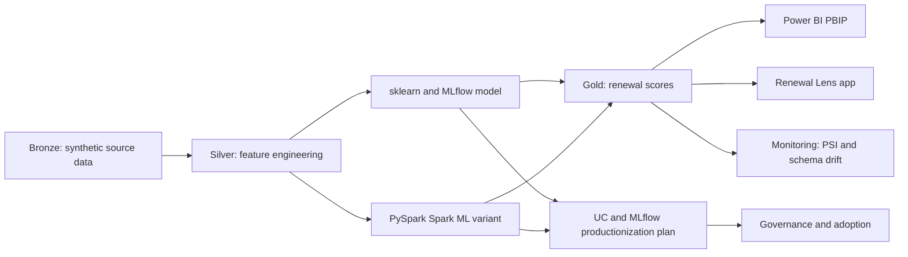
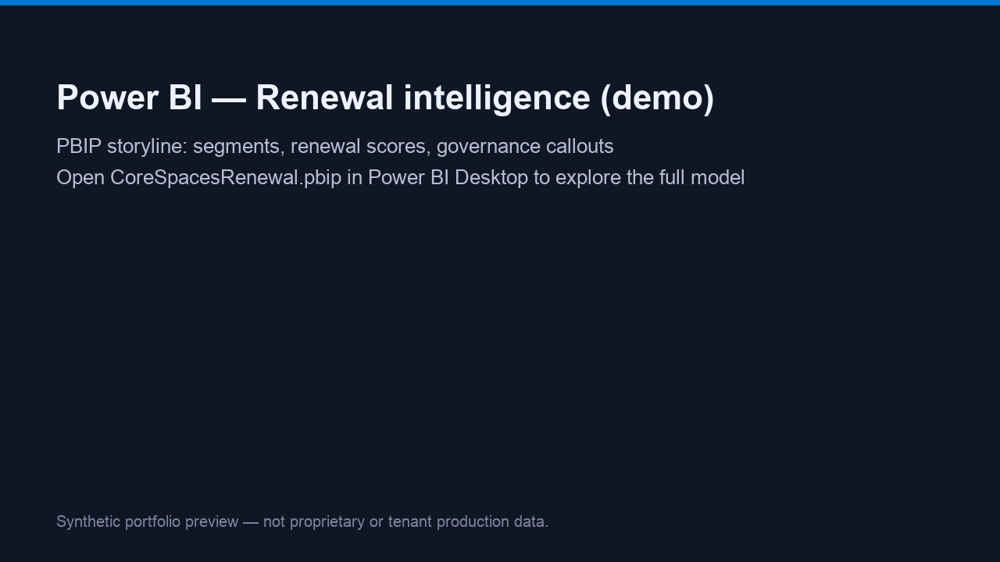
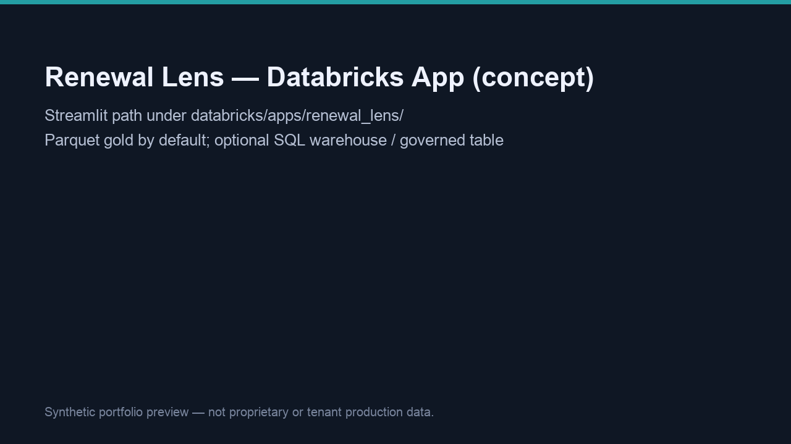
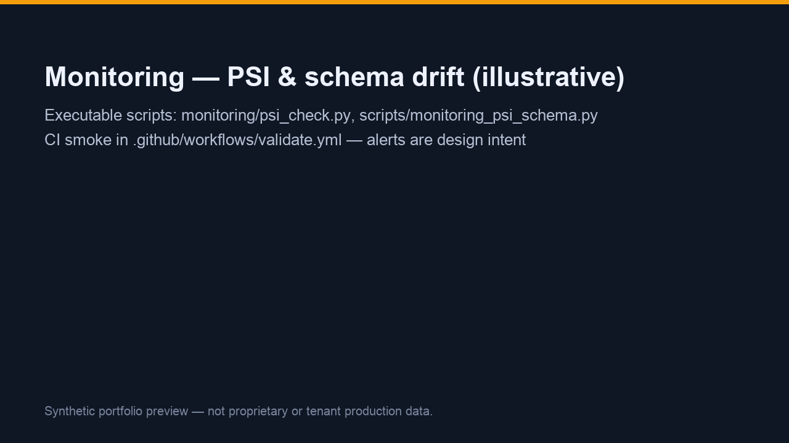

# Core Spaces Renewal Intelligence Demo

[](https://github.com/prendleman/portfolio_demo/actions/workflows/validate.yml?query=branch%3Amain)

Synthetic **Databricks / MLflow / Power BI** portfolio package for
**renewal prediction**, risk-style segmentation, **AI
governance**, and **BI consumption**.

It is structured the way an **AI Architect & Engineering
Director** (or Director of AI Architecture) would tell an
end-to-end story: source-to-features-to-model-to-scores-to-BI,
with honest **design intent** where a real tenant is not wired.

This repository **does not** use Core Spaces proprietary data.

It is a **reviewer walkthrough**: architecture, **Databricks-style
lifecycle** patterns, honest **design intent** versus what is
runnable in-repo, and language that works for both technical and
business stakeholders.

## Why this exists

The goal is to show how a practical AI architecture problem
becomes a **small, inspectable codebase**.

This is **not** a claim of a **fully productionized** enterprise
platform.

The **business scenario** is renewal intelligence: where renewal
probability may interact with leasing behavior, service load,
pricing signals, tenure, and operational friction.

All of that is **fabricated** in this demo.

The **technical scenario** shows how that problem maps through:

- Bronze / silver / gold layers (synthetic → features → scores)
- Feature engineering prior to training
- **scikit-learn + MLflow** and **PySpark / Spark ML** modeling paths
- MLflow experiment tracking and **productionization patterns**
  (Unity Catalog concepts are **tenant-dependent**)
- Power BI / **Fabric-ready** consumption (import-mode PBIP for
  offline review)
- **Monitoring** (executable PSI + schema drift scripts;
  alerting is **design intent**)
- **Copilot Studio grounding design** (contract + manifest—not a
  **deployed** tenant agent)
- Governance and responsible AI notes

## Review This Repo in 5 Minutes

For a compact **interview-oriented** walkthrough (synthetic demo framing, first 90 days, and known limitations), see [`INTERVIEW_REVIEW.md`](INTERVIEW_REVIEW.md).

1. Skim the **architecture map** below for the full flow.
2. Open
   [`databricks/02b_train_sparkml_variant/`](databricks/02b_train_sparkml_variant/)
   for the **PySpark / Spark ML** path.
3. Open
   [databricks/docs/PRODUCTIONIZATION_UC_MLFLOW.md][prod-uc-mlflow-doc]
   for Unity Catalog / MLflow **productionization pattern** (see
   **What this demonstrates** in that doc).
4. Open [`monitoring/psi_check.py`](monitoring/psi_check.py) and
   [`.github/workflows/validate.yml`](.github/workflows/validate.yml)
   for **monitoring** and **CI validation**.
5. Open
   [`research/COPILOT_STUDIO_DESIGN_PATTERN.md`](research/COPILOT_STUDIO_DESIGN_PATTERN.md)
   for the **Copilot Studio** grounding pattern (design contract,
   not a deployed agent).
6. Open
   [`powerbi/interview_loom_script.md`](powerbi/interview_loom_script.md)
   for a **business-facing** walkthrough script.

## Architecture Overview



## Visual Preview

Illustrative preview cards for quick orientation (synthetic styling—not captured from a live tenant or proprietary systems). See [`screenshots/README.md`](screenshots/README.md) to replace with your own exports.

GitHub sometimes fails to render images that sit inside **Markdown** pipe tables; this block uses an **HTML** table so previews stay reliable on the repo home page.

<table>
  <thead>
    <tr>
      <th>Artifact</th>
      <th>Preview</th>
    </tr>
  </thead>
  <tbody>
    <tr>
      <td width="28%"><strong>Power BI Renewal Intelligence overview</strong></td>
      <td></td>
    </tr>
    <tr>
      <td><strong>Renewal Lens app concept</strong></td>
      <td></td>
    </tr>
    <tr>
      <td><strong>Monitoring / drift output</strong></td>
      <td></td>
    </tr>
  </tbody>
</table>

## What Is Implemented vs. Design Intent

| Area | Implemented in repo | Design intent / tenant-dependent |
| --- | --- | --- |
| Synthetic source data | Yes | Replace with **governed** Yardi / CRM / ERP feeds |
| Bronze / silver / gold flow | Yes (Parquet; Delta snippets optional) | Delta tables, Unity Catalog volumes, scheduled jobs |
| Feature engineering | Yes | UC **feature tables**, shared contracts |
| scikit-learn + MLflow model | Yes | Promote via **Model Registry** when `REGISTER_MODEL_NAME` is set on Databricks |
| PySpark / Spark ML variant | Yes | Register **PipelineModel** in MLflow in your workspace |
| Gold scoring output | Yes | **Governed** renewal score tables, RLS/CLS |
| Monitoring | PSI + schema scripts, CI smoke | Alerts, thresholds, **job gates** |
| Power BI consumption | PBIP import demo | DirectLake / **governed** semantic model |
| Databricks app | Streamlit; Parquet default; optional `GOLD_TABLE` | Databricks App + **governed** gold or SQL warehouse |
| Copilot Studio | Grounding contract + design doc | **Tenant** agent with approved topics and actions |
| Enterprise integrations | Architecture + field dictionary stubs | Live connectors (out of scope for this repo) |

## What to Look At

| Reviewer interest | Start here |
| --- | --- |
| Executive / business framing | This README and [`powerbi/interview_loom_script.md`](powerbi/interview_loom_script.md) |
| Databricks lifecycle | [`databricks/`](databricks/) |
| PySpark / Spark ML | [`databricks/02b_train_sparkml_variant/`](databricks/02b_train_sparkml_variant/) |
| MLflow and model lifecycle | [`python/cs_portfolio/train.py`](python/cs_portfolio/train.py) and [`databricks/docs/PRODUCTIONIZATION_UC_MLFLOW.md`](databricks/docs/PRODUCTIONIZATION_UC_MLFLOW.md) |
| Monitoring | [`monitoring/psi_check.py`](monitoring/psi_check.py) and [`scripts/monitoring_psi_schema.py`](scripts/monitoring_psi_schema.py) |
| CI / validation | [`.github/workflows/validate.yml`](.github/workflows/validate.yml) |
| Enterprise integration thinking | [`research/integration_architecture.md`](research/integration_architecture.md) and [`research/integration_field_dictionary.md`](research/integration_field_dictionary.md) |
| Copilot Studio design | [`research/COPILOT_STUDIO_DESIGN_PATTERN.md`](research/COPILOT_STUDIO_DESIGN_PATTERN.md) |
| Governance | [`databricks/docs/governance.md`](databricks/docs/governance.md) |
| KPI and grain | [`SCOPE.md`](SCOPE.md) |

## Layer map (artifacts)

| Layer | Artifact | JD talking point |
| --- | --- | --- |
| Bronze | `databricks/00_synthetic_data/synthetic_bronze.ipynb` + `data/bronze/*.parquet` | Deterministic synthetic lake landing |
| Silver | `databricks/01_feature_pipeline/feature_silver.ipynb` + `data/silver/lease_episode_features.parquet` | Feature engineering prior to training |
| **PySpark / Spark ML** | [`databricks/02b_train_sparkml_variant/train_sparkml_renewal.py`](databricks/02b_train_sparkml_variant/train_sparkml_renewal.py) + [`README`](databricks/02b_train_sparkml_variant/README.md); notebook in [`databricks/04_sparkml_variant/`](databricks/04_sparkml_variant/) | Same renewal model on **Spark DataFrames + `pyspark.ml` Pipeline** |
| MLflow (sklearn) | `databricks/02_train_renewal_model/train_mlflow.ipynb` + [`python/cs_portfolio/train.py`](python/cs_portfolio/train.py) | Tracking + signatures; registry when **`REGISTER_MODEL_NAME`** is set (e.g. `main.demo.renewal_propensity_classifier`) |
| Gold | `databricks/03_score_batch/score_gold.ipynb` + `data/gold/gold_renewal_scores.{parquet,csv}` | Batch scoring for BI + audit columns |
| BI | `powerbi/CoreSpacesRenewal.pbip` | PBIP-first Git workflow + optional PBIX export (`powerbi/release/README.txt`) |

For the responsible-AI checklist and rollout narrative, read
[`databricks/docs/governance.md`](databricks/docs/governance.md).

**Enterprise field stubs:**

- [`research/integration_field_dictionary.md`](research/integration_field_dictionary.md)
- [`research/integration_architecture.md`](research/integration_architecture.md)

## Quick start (local, no Databricks required)

```powershell
python -m venv .venv
.\.venv\Scripts\pip install -r requirements.txt
copy .env.example .env   # optional: then edit .env for MLflow / Copilot URL / Databricks
# Default path = pickle + joblib (fast). For MLflow, set in .env or shell:
#   PORTFOLIO_USE_MLFLOW=1
#   MLFLOW_TRACKING_URI=file:/.../mlruns
python scripts/run_local_pipeline.py
```

Outputs land under `data/**` and `artifacts/` (joblib + metadata
are git-ignored).

## Environment file (optional)

Copy **`.env.example`** to **`.env`** at the repo root and replace
placeholders (tokens, workspace URLs, notebook paths).

**`.env` is gitignored** — never commit it.

After `pip install -r requirements.txt`, these scripts load `.env`
automatically via `python-dotenv` when present:

- `scripts/run_local_pipeline.py` — e.g. `PORTFOLIO_USE_MLFLOW`,
  `MLFLOW_TRACKING_URI`
- `scripts/sync_pbip_report.py` — ensures child processes
  inherit loaded variables (runs
  **`scripts/update_pbip_gold_csv_path.py`** before PBIR
  validation)
- `scripts/gen_pbip_report_pages.py` —
  `COPILOT_STUDIO_PUBLISH_URL` overrides the Copilot teaser link
  before reading `publish-url.txt`
- `scripts/databricks_deploy_demo_job.py` — Databricks Jobs API
  variables (see `.env.example`)
- `scripts/fetch_corespaces_live_logo.py` — picks up any future
  proxy/tooling vars you add

## Quick start (Databricks)

### Repos root path (`PORTFOLIO_REPO_ROOT`)

Use the folder names from the workspace **Repos** tree. Do **not**
write path placeholders using raw angle brackets around segment
names: some HTML and Markdown pipelines treat those as tags, strip
them, and can collapse the path to a broken `.../Repos//` form.

Pattern (replace the two path segments with your real folders):

```text
PORTFOLIO_REPO_ROOT=/Workspace/Repos/YOUR_GIT_FOLDER/YOUR_REPO_FOLDER
```

Concrete example:

```text
PORTFOLIO_REPO_ROOT=/Workspace/Repos/your.user@company.com/portfolio_demo
```

### Steps

1. Import this repo via **Repos** and set `PORTFOLIO_REPO_ROOT` to
   match the clone path shown in the UI.
2. Optional widget `base_path`: point `PORTFOLIO_BASE_PATH` at
   `/Volumes/...` or `/dbfs/FileStore/portfolio_demo` so Parquet
   mirrors shared storage.
3. Run notebooks / tasks in order: `00` → `01` →
   **`02b_train_sparkml_variant/train_sparkml_renewal.py`**
   (optional Spark ML) or `02_train_renewal_model` (sklearn
   MLflow) → `03`. See `04_sparkml_variant` for the notebook-first
   Spark path.

Adjust the default `sys.path` insert in notebooks if your layout
differs.

## Power BI authoring

Open `powerbi/CoreSpacesRenewal.pbip` in Power BI Desktop.

Import mode reads `data/gold/gold_renewal_scores.csv` via the
**GoldRenewalCsvPath** M parameter in
`powerbi/CoreSpacesRenewal.SemanticModel/definition/expressions.tmdl`
(single-line definition for Desktop compatibility — must be an
**absolute** path; edit via **Manage parameters** or that file).

Synthetic gold carries **ecosystem_segment**, **metro_cluster**,
**flagship_style**, **brand_line**, and **property_name** for
slicers and tooltips (all invented labels; not corporate data).

Refresh after re-running scoring.

Deck pages include **AI platform & Fabric** (`aa55_ai_platform`):
lineage/version visuals plus Copilot-manifest-informed hero copy
when `research/copilot_topics_manifest.json` is present.

**Operating checklist:**
[`docs/DEMO_RUNBOOK.md`](docs/DEMO_RUNBOOK.md) (Databricks → CSV →
PBIP refresh).

Patch the semantic CSV parameter with:

```text
python scripts/update_pbip_gold_csv_path.py
```

(`GOLD_RENEWAL_CSV_ABSOLUTE_PATH` or repo-local gold).

To **regenerate deck pages** (research markdown → chrome → CSV
path hook → structural checks):

```text
python scripts/sync_pbip_report.py
```

**Live site logomark (Selenium + Chrome):** after `pip install -r
requirements.txt`, run:

```text
python scripts/fetch_corespaces_live_logo.py
```

This writes `branding/logomark_from_live_site.png` and updates
`CS_Logomark900112233.png` when header capture or bundled icon
succeeds.

Trademark remains with Core Spaces; demo-only use.

## Interview appendix — Core Spaces public research (independent)

Synthetic modeling in this repo is **not** affiliated with Core
Spaces.

For **public** positioning, departments, competitors, and JD gap
analysis, see [`research/README.md`](research/README.md).

Highlights:

- **Site capture:** `python scripts/fetch_corespaces_public.py`
  →
  [`research/core_spaces/site/capture_manifest.md`](research/core_spaces/site/capture_manifest.md)
- **Opportunity map (*hypotheses*):**
  [`research/core_spaces/opportunity_map.md`](research/core_spaces/opportunity_map.md)
- **Peers (student + BTR):**
  [`research/core_spaces/competitive_landscape.md`](research/core_spaces/competitive_landscape.md)
- **JD / AI scaffolding (programmatic):** `python
  scripts/generate_jd_ai_scaffold.py` — expands Copilot manifest
  bindings, emits Databricks Apps Streamlit starter
  (`databricks/apps/renewal_lens/`), Asset Bundle template, and
  `research/genai_ticket_triage_wedge.md`.
- **Loom walkthrough script (chapters + talking points):**
  [`powerbi/interview_loom_script.md`](powerbi/interview_loom_script.md)
- **Databricks bundle how-to:**
  [`databricks/asset_bundle/README.md`](databricks/asset_bundle/README.md)
  (CLI bundles **or** Jobs API /
  `scripts/databricks_deploy_demo_job.py`)
- **Repo ↔ GitHub sanity:** `python
  scripts/verify_github_repo_remote.py` (compares `origin` with
  `GIT_REPO_URL`)
- **Copilot Studio:** a **design pattern and grounding
  contract** showing how approved topics, refusals, semantic
  model context, and citation/filter rules could be structured
  in a **tenant-dependent** deployment — see
  [`research/copilot_topics_manifest.json`](research/copilot_topics_manifest.json),
  [`research/COPILOT_STUDIO_DESIGN_PATTERN.md`](research/COPILOT_STUDIO_DESIGN_PATTERN.md),
  and
  [`powerbi/copilot-studio/README.md`](powerbi/copilot-studio/README.md).

## Repo metadata (GitHub)

Repo **description**, **topics**, CLI/PAT maintenance scripts, and
**Linguist** notes live in
[`docs/REPO_MAINTENANCE.md`](docs/REPO_MAINTENANCE.md).

**Version snapshot:** see [`CHANGELOG.md`](CHANGELOG.md) and tag
**`v1.0.0`**. Copy-paste blurbs for LinkedIn, email, and profiles:
[`docs/OUTREACH_SNIPPETS.md`](docs/OUTREACH_SNIPPETS.md).

## Credits / scaffold notes

PBIR theme scaffolding was bootstrapped from the public
**`RuiRomano/pbip-demo`** sample (`CY24SU10` theme + structural
conventions) before replacing pages and the semantic model with
the renewal storyline.

[prod-uc-mlflow-doc]: databricks/docs/PRODUCTIONIZATION_UC_MLFLOW.md
